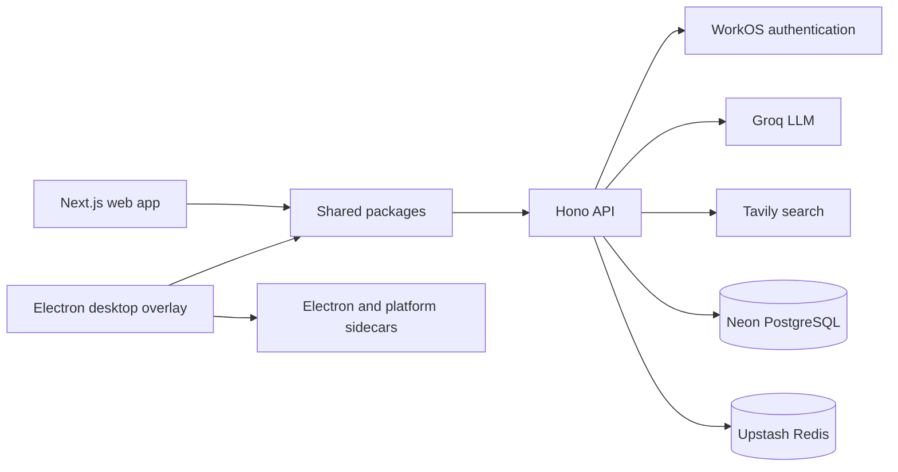

# Sable


Sable is an AI-powered operating-system layer delivered as a transparent desktop overlay and companion web application. It combines conversational “Flow Mode” with a widget-based “Focus Mode”, backed by authenticated chat, search, conversation history, and cross-platform desktop integrations.

## Architecture



## Workspace map

| Path | Role |
| --- | --- |
| `apps/desktop` | Electron/Vite overlay, Focus Mode widgets, authentication window, and OS bridge |
| `apps/web` | Browser-based Next.js experience |
| `apps/api` | Hono API for chat, streaming, search, users, and conversations |
| `packages/services` | Shared service clients |
| `packages/store` | Shared Zustand state |
| `packages/types` | Cross-application TypeScript types |
| `packages/utils` | Shared utilities |

## Features

- always-available Electron overlay;
- Flow Mode chat and Focus Mode workspace widgets;
- streaming and non-streaming Groq completions;
- conversation persistence in PostgreSQL;
- WorkOS authentication;
- Tavily-backed web search;
- Redis rate limiting;
- platform packaging for macOS and Windows.

## Prerequisites

- Node.js 18 or newer;
- pnpm 9;
- Neon/PostgreSQL, Upstash Redis, WorkOS, and Groq credentials;
- Tavily credentials when web search is enabled.

## Install

```bash
corepack enable
pnpm install
cp apps/api/.env.example apps/api/.env
cp apps/desktop/.env.example apps/desktop/.env
```

Fill the environment files with development credentials. Keep all secret keys in the API environment; only publishable client configuration should use `VITE_` variables.

## Development

Run the complete workspace:

```bash
pnpm dev
```

Or run individual applications:

```bash
pnpm dev:api
pnpm dev:web
pnpm dev:desktop
```

For the full Electron development window, use `pnpm --filter @sable/desktop electron:dev`.

## Database and API

```bash
pnpm --filter @sable/api db:push
pnpm --filter @sable/api dev
```

The local API defaults to `http://localhost:3001`. Endpoint contracts, authentication, rate limits, and response examples are documented in `apps/api/API_DOCUMENTATION.md`.

## Validation and builds

```bash
pnpm type-check
pnpm lint
pnpm build:api
pnpm build:web
pnpm build:desktop
```

## Status

Active prototype. Several integrations span desktop, browser, and server trust boundaries; review token storage, OAuth redirects, CORS, IPC exposure, and client-side environment variables before distributing production builds.
